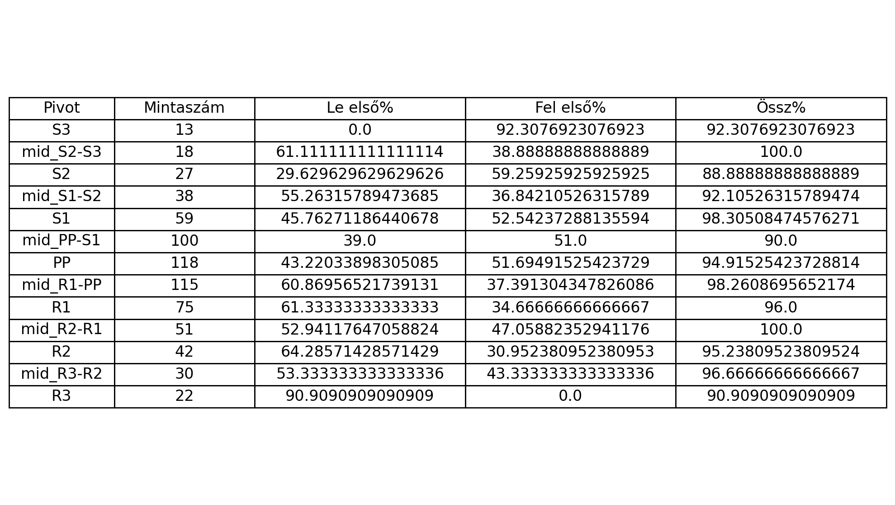
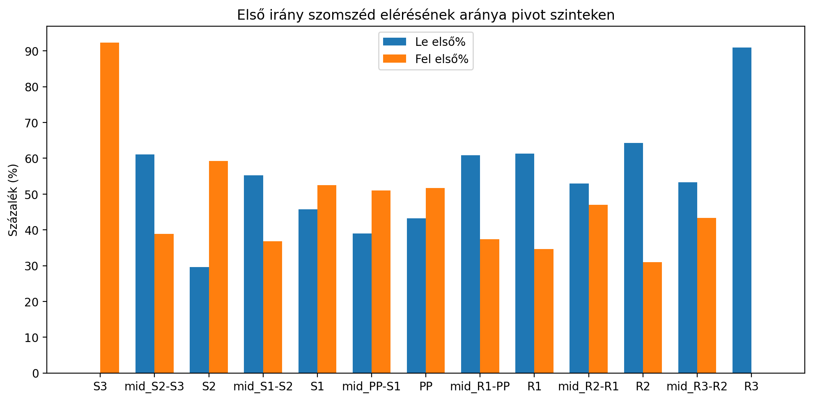

# Pivot és mid-szintek statisztikai elemzése 1M OHLC adatokból

Ez a program 1 perces (1M) OHLC (Open, High, Low, Close) adatokból napi pivot- és mid-szintek (S3…R3, mid_...-... , PP) első érintésének és az első szomszéd elérésének statisztikáját készíti el.

## Fő funkciók

- **Pivot- és mid-szintek számítása**: A tegnapi High, Low, Close alapján kiszámítja a klasszikus pivot szinteket (S3, S2, S1, PP, R1, R2, R3) és a köztes mid-szinteket (pl. `mid_S2-S3`, `mid_PP-S1`).
- **Első érintés elemzése**: Minden kereskedési napon minden szintnél megvizsgálja, hogy az árfolyam mikor érintette először az adott szintet, és hogy utána először a közvetlen felső vagy alsó szomszédszintet érte-e el.
- **Statisztikai összesítés**: Megmutatja, hogy az egyes szinteknél az első szomszéd elérésének aránya merre történt (le/fel), illetve ezek százalékos megoszlását.
- **Automatikus vizualizáció**: A program elmenti a fő eredménytáblázatot PNG-ben, valamint egy bar chartot is generál a szomszéd elérésének arányairól.

## Használat

```sh
python main.py --csv <input_file> [--sep <separator>] [--tz <timezone>] [--datetime <col>] [--open <col>] [--high <col>] [--low <col>] [--close <col>]
```

### Példa

```sh
python main.py --csv audcad_1m.csv --sep "\t" --tz Europe/Budapest
```

### Paraméterek

- `--csv` (**kötelező**): Bemeneti CSV/TSV fájl (pl. MetaTrader export)
- `--sep`: Mezőelválasztó (alapértelmezett: tab, azaz `\t`)
- `--tz`: Cél időzóna a napi határokhoz (alapértelmezett: UTC, pl. `Europe/Budapest`)
- `--datetime`, `--open`, `--high`, `--low`, `--close`: Oszlopnevek testreszabása (alapértelmezett: MetaTrader formátum)

## Bemeneti fájl formátuma

A program automatikusan felismeri a fejlécet. Elvárt oszlopok:

- Time (vagy testreszabható)
- Open
- High
- Low
- Close
- Volume (nem kötelező, de lehet benne)
- Extra oszlopok figyelmen kívül lesznek hagyva

Példa (tab szeparált):

```
Time\tOpen\tHigh\tLow\tClose\tVolume
2024-12-24 04:37:00\t0.89691\t0.89702\t0.89684\t0.89687\t26
...
```

## Kimenet

A program az **ELSŐ IRÁNY** statisztikát írja ki, például:

```
ELSŐ IRÁNY (melyik szomszédot érte el először):
Pivot         Mintaszám     Le első%    Fel első%    Össz%
----------------------------------------------------------
S3                   11         0.0%        90.9%    90.9%
mid_S2-S3            15        53.3%        46.7%   100.0%
...
```

- **Pivot**: Az adott szint neve (pl. S1, mid_PP-S1, PP, stb.)
- **Mintaszám**: Hányszor volt az adott szint először érintve egy napon
- **Le első%**: Hány százalékban érte el először az alsó szomszédot
- **Fel első%**: Hány százalékban érte el először a felső szomszédot
- **Össz%**: A két irány összege (ha egyik szomszédot sem érte el, ez kevesebb mint 100%)

Az eredmények automatikusan elmentésre kerülnek:

- **Táblázat PNG-ben**: `elso_irany_table.png`
- **Bar chart**: `elso_irany_barchart.png`

### Példák a kimeneti ábrákra

#### Eredménytáblázat (PNG)


#### Bar chart (PNG)


## Megjegyzések

- Egy napon több pivot szint is lehet "első érintés" (azaz minden szintnél csak az első érintést számolja, ha aznap először érte el az ár).
- A program automatikusan kezeli a fejlécet, extra oszlopokat, és a különböző időzónákat.
- A mid-szintek elnevezése: `mid_<felette lévő szint>-<alatta lévő szint>` (pl. mid_PP-S1).
- Pie chart NINCS, csak táblázat és bar chart készül.

## Függőségek

- pandas
- pytz
- matplotlib

Telepítés:

```sh
pip install pandas pytz matplotlib
```

## Szerző

Króner Barnabás
FOREXHUN

